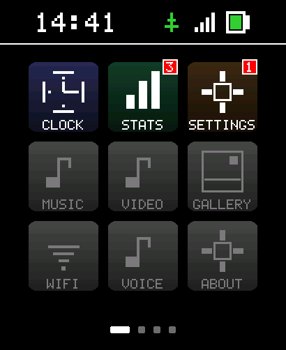

# SpawnWear

A small wearable OS — written in C# on .NET nanoFramework — for the **Waveshare ESP32-S3 Touch AMOLED 2.06" Watch**.

## Current state of the UI

<p align="center">
  
</p>

Screenshot captured live over WiFi from the watch (`http://<watch-ip>:8080/`). 3x3 launcher with status bar (time + USB + BLE + battery) and 4-page indicator at the bottom. CLOCK / STATS / SETTINGS are functional today; MUSIC / VIDEO / GALLERY / WIFI / VOICE / ABOUT are placeholders for apps that ship in later phases. We update this image as the UI moves toward Android-quality polish.

Think Android, but watch-sized and ESP32-shaped: a kernel/HAL layer of C# drivers for the watch hardware, system services for radios / audio / power, a UI framework for drawing and input, a launcher home screen, and a small set of built-in apps (Settings, Clock, etc.) that talk to the system services. No single C++ binary, no single fixed UI — apps come and go, services run in the background.

It comes with a complementary **Blazor WebAssembly PWA** that mirrors the watch UI over BLE + WiFi for headless setup, debugging, and remote control. Same C# language on both sides.

Constrained by the silicon: ESP32-S3R8 with 8MB PSRAM and 32MB flash. Everything — kernel, drivers, services, framework, apps, user data — fits in that envelope.

---

## Primary Target Hardware

This project targets **ONE** specific board. All pins, drivers, and capabilities documented below are for this exact device. Do not generalize — other Waveshare AMOLED watches (1.8 / 1.91 / 2.41 / C6 variant) use different chips and pinouts.

**Waveshare ESP32-S3-Touch-AMOLED-2.06**
- Product page: <https://www.waveshare.com/esp32-s3-touch-amoled-2.06.htm>
- Wiki: <https://www.waveshare.com/wiki/ESP32-S3-Touch-AMOLED-2.06>
- Schematic PDF: <https://files.waveshare.com/wiki/ESP32-S3-Touch-AMOLED-2.06/ESP32-S3-Touch-AMOLED-2.06.pdf>
- Vendor demos (Arduino + ESP-IDF): <https://github.com/waveshareteam/ESP32-S3-Touch-AMOLED-2.06>
- Amazon (US, with battery): <https://www.amazon.com/gp/product/B0FJQZ7SBG>
- Amazon (US, no battery): <https://www.amazon.com/Waveshare-ESP32-S3-Development-Dual-core-Microphones/dp/B0FJFNXGNX>

### SoC

| Field | Value |
|---|---|
| Part | **ESP32-S3R8** (Espressif, embedded PSRAM variant) |
| CPU | Xtensa **LX7** dual-core, up to **240 MHz** |
| SRAM | 512 KB internal |
| ROM | 384 KB internal |
| PSRAM | **8 MB** octal, in-package |
| Flash | **32 MB** external (W25Q256-class) |
| Radio | 2.4 GHz Wi-Fi 802.11 b/g/n + **Bluetooth 5 LE** |
| USB | Native **USB-OTG** off the ESP32-S3 (USB-C connector) |
| Antenna | On-board SMD antenna |

### Display

| Field | Value |
|---|---|
| Panel | 2.06" AMOLED, capacitive touch |
| Resolution | **410 × 502** |
| Color depth | 16.7M (24-bit) |
| Driver IC | **CO5300** (QSPI, 80 MHz max) |
| Backlight | Software-controlled via CO5300 register `0x51` (0x00 dark → 0xFF bright) — no separate backlight pin |

### Touch

| Field | Value |
|---|---|
| Controller | **FT3168** self-capacitance (FocalTech) |
| Bus | I²C, address **0x38** |
| Speed | 10 kHz – 400 kHz |

### Sensors / On-board ICs

| IC | Role | Bus / Addr |
|---|---|---|
| **QMI8658** | 6-axis IMU (3-axis accel + 3-axis gyro), step-count, motion / gesture | I²C, addr **0x6B** (alt 0x6A) |
| **PCF85063** | Real-Time Clock, battery-backed via AXP2101 | I²C, addr **0x51** |
| **AXP2101** | Power Management IC — charging, multi-rail outputs, ADC for battery V/I/temp, **EXIO6** = PWR side button | I²C, addr **0x34** |
| **ES8311** | Audio codec (DAC + line-in ADC), drives speaker | I²C, addr **0x18** |
| **ES7210** | Echo-cancel ADC, drives dual PDM microphone array | I²C, addr **0x40** |
| Speaker | Onboard, driven through ES8311 + class-D amp (PA_EN on **GPIO46**) | — |
| Microphones | **Dual PDM array**, fed into ES7210 | — |
| TF / microSD | Slot, 4-bit SDMMC | dedicated GPIO (see pin map) |
| Buttons | **BOOT** (direct GPIO) + **PWR** (via AXP2101) | see pin map |
| Vibration | Not present on this SKU | — |

### Pin Map

Authoritative source: vendor `pin_config.h` (cloned to `_vendor-waveshare-demo/`) and the schematic PDF above.

#### AMOLED Display — QSPI (CO5300)
| Signal | GPIO |
|---|---|
| SDIO0 | **GPIO4** |
| SDIO1 | **GPIO5** |
| SDIO2 | **GPIO6** |
| SDIO3 | **GPIO7** |
| SCLK  | **GPIO11** |
| CS    | **GPIO12** |
| RESET | **GPIO8** |
| TE (Tearing-Effect sync, optional) | **GPIO13** |

#### I²C bus (shared by FT3168, QMI8658, PCF85063, AXP2101, ES8311, ES7210)
| Signal | GPIO |
|---|---|
| SDA   | **GPIO15** |
| SCL   | **GPIO14** |

#### Touch (FT3168) extra pins
| Signal | GPIO |
|---|---|
| INT   | **GPIO38** |
| RESET | **GPIO9**  |

#### Sensor / RTC interrupts
| Signal | GPIO |
|---|---|
| QMI8658 INT (motion / data-ready) | **GPIO21** |
| PCF85063 INT (alarm)              | **GPIO39** |
| AXP2101 IRQ output (PWR button + charge events, falls when AXP raises any IRQ) | **GPIO10** |

#### TF / microSD card (SDMMC)
| Signal | GPIO |
|---|---|
| CLK   | **GPIO2**  |
| CMD   | **GPIO1**  |
| DATA  | **GPIO3**  |
| CS    | **GPIO17** |

#### Audio I²S (ES8311 playback / ES7210 record)
| Signal | GPIO |
|---|---|
| MCLK  | **GPIO16** |
| BCLK  | **GPIO41** |
| LRCLK / WS | **GPIO45** |
| DOUT (codec → speaker) | **GPIO40** |
| DIN  (mic → codec)     | **GPIO42** |
| PA enable (speaker amp) | **GPIO46** |

#### Buttons
| Button | Path | Notes |
|---|---|---|
| **BOOT** | **GPIO0** (direct, active LOW) | Hold during power-on → ROM download mode. During normal boot, used as user button — single / double / multi / long press |
| **PWR**  | **AXP2101 EXIO6** (over I²C, active HIGH) | Hold 6 s → power off. From off + on charger → click to power on. Don't hold > 6 s during normal use or device powers off |

#### USB
- USB-C, **native USB-OTG** off the ESP32-S3 (CDC + JTAG via the same port).
- Auto-download circuit on board — no manual reset/boot dance needed for normal flashing.

---

## OS Architecture

```
┌──────────────────────────────────────────────────────────────────────────────┐
│  Apps (managed C#, run in-process under the SpawnWear app host)              │
│  • Launcher (home / clock / app grid)    • Settings        • Clock           │
│  • AI Assistant (voice + text → home PC over WebRTC)                         │
│  • Media Player                          • Voice Recorder  • Activity (IMU)  │
│  • [user-installable later via OTA-style app payloads]                       │
├──────────────────────────────────────────────────────────────────────────────┤
│  UI Framework                                                                │
│  • Drawing primitives + framebuffer    • Touch / button input dispatch       │
│  • Navigation stack + lifecycle        • Theme + system widgets              │
├──────────────────────────────────────────────────────────────────────────────┤
│  System Services (singletons, started at boot)                               │
│  • Power (AXP2101)        • WiFi (station + soft-AP)    • BLE (GATT server) │
│  • RTC (PCF85063)         • Audio (ES8311 + ES7210)     • Storage (TF/flash)│
│  • Sensors (QMI8658)      • Update (OTA, app payloads)  • Logger            │
├──────────────────────────────────────────────────────────────────────────────┤
│  HAL / Drivers (hand-rolled C# unless upstream nanoFramework already covers) │
│  • CO5300 AMOLED via QSPI              • FT3168 touch via I²C                │
│  • AXP2101 PMIC                        • PCF85063 RTC                        │
│  • QMI8658 IMU                         • ES8311 + ES7210 audio + PDM mics    │
│  • TF / microSD via SDMMC              • USB-CDC                             │
├──────────────────────────────────────────────────────────────────────────────┤
│  .NET nanoFramework runtime                                                  │
│  • Wi-Fi stack (System.Device.Wifi)    • BLE stack (Device.Bluetooth)        │
│  • System.Net / IO / Threading         • Hardware.Esp32                      │
├──────────────────────────────────────────────────────────────────────────────┤
│  Espressif ESP32-S3 firmware (managed by nanoFramework, not SpawnWear)       │
└──────────────────────────────────────────────────────────────────────────────┘

                BLE (always-available)            WiFi (when configured)
                       │                                  │
                       ▼                                  ▼
        ┌────────────────────────────────────────────────────────┐
        │  Blazor WebAssembly PWA — companion / remote UI        │
        │  • Mirrors every built-in app over BLE + WiFi          │
        │  • Adds a comfortable laptop-grade keyboard for setup  │
        │  • Not required to use the watch                       │
        └────────────────────────────────────────────────────────┘
```

**The watch is the primary device.** Everything ships with a touchscreen UI on the AMOLED. The PWA is a complementary remote — convenient for first-time WiFi provisioning before the on-device keyboard exists, for live debugging from a laptop, and for showing off the watch's API surface from a browser. Nothing on the PWA is required to use the watch.

### What "OS-shaped" means here

- **Apps are not fixed.** The launcher hosts a list of apps; built-in ones are compiled into the firmware initially, but the long-term aim is OTA-installable app payloads (limited by what nanoFramework's assembly loader can do at runtime — likely an in-place re-flash of a partition slice, not true dynamic loading).
- **Services are background daemons,** consumed by apps via interfaces. Only one PMIC, one BLE stack, one display backlight — the system service owns it, apps ask politely.
- **Lifecycle is Android-flavored.** Apps have `OnCreate` / `OnResume` / `OnPause` / `OnDestroy`. The launcher decides what's foregrounded. Background services keep ticking through pause/resume.
- **Resource budgets are explicit.** PSRAM (8 MB), heap, flash slots, BLE MTU, WiFi airtime. Apps that hog get killed.
- **Power-aware by default.** AXP2101 + display-rail control + WiFi/BLE radio gating are first-class system concerns, not afterthoughts.

---

## Apps Catalog (built-in)

The watch ships with a small core set of first-party apps. They're listed here so the launcher's job is concrete and so the system services know who their consumers are.

| App | What it does | Primary services it uses |
|---|---|---|
| **Launcher** | Home screen — clock face, app grid, status row (battery / WiFi / BLE / time). Foreground default after boot. | UI Framework, Power, RTC, Storage |
| **Settings** | Bluetooth, BLE, WiFi, Battery, Display, Sound, Time, About, OTA. Each subsystem is one page. | All system services |
| **Clock** | Watch faces, alarms, timer, stopwatch. Several faces selectable. | RTC, UI Framework, Power |
| **AI Assistant** | **The flagship app.** Voice + text conversation with an AI running on TJ's home PC over WebRTC (SpawnDev.RTC). Push-to-talk button, live transcript on screen, TTS replies through the speaker, on-screen keyboard for typed messages, history scrollback. Works whenever the watch can reach the PC over WiFi (LAN or via signaling relay). | Audio (ES8311 playback + ES7210 PDM mic), WiFi, UI Framework, RTC (timestamps), Storage (history) |
| **Media Player** | Local audio playback from microSD or streamed over WiFi. Play / pause / next / volume on screen. | Audio (ES8311), Storage (TF), WiFi |
| **Voice Recorder** | Capture mic to a file on the microSD. Listen back, delete, share to PC over WiFi. | Audio (ES7210 PDM), Storage |
| **Activity** | IMU-driven step count, motion log, simple charts. | Sensors (QMI8658), RTC, Storage, UI Framework |

The PWA companion mirrors every one of these as a remote-UI page reachable via Web Bluetooth + WiFi, so a developer or anyone with the watch's IP can drive any app from a browser.

---

## Roadmap

The display is the user interface, so it leads. Plumbing (radios, sensors, audio, OTA) is still needed - a watch with no radios is a fancy clock - but each piece gets exposed THROUGH an app or Settings page, not as a substitute for one.

**Where we are as of 2026-05-04:**

- ✅ **Phase 1** - Display + touch + input substrate. Complete 2026-05-03.
- ✅ **Phase 2** - UI Framework + Launcher. Largely complete 2026-05-04: gradient tiles + rounded corners + status bar with WiFi/USB/battery + Android-style pill page indicator + 3x3 launcher with notification badges + screen navigation.
- 🚧 **Phase 3** - System Services. AXP2101 + PCF85063 + WiFi + HTTP server shipped; service-host scaffold + QMI8658 IMU + Storage + Logger still TODO.
- ⏭ **Phase 4** - Settings app (next focus once service-host scaffold lands)
- ⏭ **Phase 5** - Clock app (V1 watchface with date label already shipped; alarms + multiple faces are Phase 5)
- ⏭ **Phase 6** - Audio service + Voice Recorder + Media Player
- ⏭ **Phase 7** - WebRTC + AI Assistant (flagship)
- ⏭ **Phase 8** - OTA + SD-card-loadable apps. Architecture verified against nf-interpreter source; full design in `Plans/sd-card-apps.md` + `Plans/app-contracts-v1.md`.
- ⏭ **Phase 9** - Activity app + user-contributed apps

Full per-phase task list with current completion state lives in **[`Plans/roadmap.md`](Plans/roadmap.md)**. Forward-looking design sketches for specific features live in [`Plans/`](Plans/). Completed work tracked in the [Status / Milestones](#status--milestones) table below.

---

## Repository Layout

This README sits at the **git repo root** (`D:\users\tj\Projects\SpawnWear\SpawnWear\`). The parent folder (`D:\users\tj\Projects\SpawnWear\`) is project scratch — vendor clones, wiki dumps, and other agent reference material live there and are intentionally outside git.

```
SpawnWear/                              ← REPO ROOT (this folder)
├── README.md                           ← (this file)
├── CLAUDE.md                           ← agent instructions for this project
├── spawn-wear.md                       ← original feature wishlist
├── SpawnWear.slnx                      ← .NET nanoFramework solution
├── SpawnWear/                          ← firmware project (.nfproj)
├── packages/                           ← NuGet packages (committed for offline builds)
├── screenshots/                        ← live framebuffer captures (README hero shot lives here)
├── tools/                              ← .NET 10 CLI scripts (deploy, attach, screenshot, size guard)
├── Docs/                               ← reference material (architecture, hardware, dev loop)
├── Plans/                              ← forward-looking design (roadmap + per-feature sketches)
├── Research/                           ← investigations + findings (deploy ceiling, WiFi compat, etc.)
├── Notes/                              ← operational know-how: chip quirks, flashing recipes, build env
├── BlazorWasmSpawnWear/                ← companion Blazor WASM PWA (TBD - see Plans/companion-pwa.md)
└── SpawnWear.Tests/                    ← Playwright + smoke tests for the PWA (TBD)
```

Outside the repo, in the parent folder (`D:\users\tj\Projects\SpawnWear\`):

```
_vendor-waveshare-demo/                 ← upstream Arduino + ESP-IDF demos (cloned)
_vendor-rust-watch/                     ← Rust port of the firmware - canonical CO5300 reference
_vendor-nanoframework-iot/              ← nanoFramework IoT.Device repo (Axp2101 driver lives here)
_vendor-nanoframework-hardware-esp32/   ← nanoFramework.Hardware.Esp32 source (no QSPI yet)
_wiki-decoded.{html,txt}                ← decoded copy of the Waveshare wiki page
ESP32-S3-Touch-AMOLED-2.06 - Waveshare Wiki.mhtml  ← raw archived wiki page
_extract-wiki.cs                        ← script that decoded the .mhtml
```

These reference files exist so pin numbers and IC behavior can be verified against the vendor's own working code without bloating the repo or violating their license. **Document everything we learn from them inside `Notes/`** so the repo stays self-contained.

---

## nanoFramework Compatibility Notes

These are the realities of running C# on this board today. None of them are blockers for Phases 1-4.

| Capability | Status | Notes |
|---|---|---|
| WiFi station + AP | **Supported** | `nanoFramework.System.Device.Wifi` |
| BLE GATT server | **Supported** | `nanoFramework.Device.Bluetooth` |
| OTA firmware update | **Supported** | nanoFramework has standard OTA (verify package API surface during Phase 3) |
| I²C device control (AXP2101 / QMI8658 / PCF85063 / FT3168) | **Supported** | `nanoFramework.Hardware.Esp32` + `System.Device.I2c` — drivers written by hand against the chip datasheets |
| PCF85063 RTC | **Supported (community driver)** | `nanoFramework.IoT.Device.Pcf85063` exists |
| AXP2101 PMIC | **Supported (community driver)** | `nanoFramework.IoT.Device.Axp2101` is comprehensive — see `_vendor-nanoframework-iot/devices/Axp2101/` |
| QMI8658 IMU | **Hand-roll driver** | No upstream nanoFramework driver; protocol is plain I²C register reads |
| FT3168 touch | **Hand-roll driver** | Same — datasheet linked above |
| AXP2101 PMIC | **Hand-roll driver** | Datasheet linked; XPowersLib (C++) is a useful reference |
| AMOLED display via CO5300 QSPI | **Gap** | nanoFramework's display drivers are SPI, not QSPI. Either contribute a QSPI bus + CO5300 driver to nanoFramework, or document and defer |
| I²S audio (ES8311 / ES7210) | **Gap / partial** | nanoFramework I²S surface is limited. PDM mic capture is even more constrained. Phase 6 is a research item before promising delivery |
| USB-CDC for `Debug.WriteLine` | **Supported** | Native USB-OTG → CDC. Standard nanoFramework path |

---

## Status / Milestones

| Date | Milestone | Notes |
|---|---|---|
| 2026-04-28 | Repo scaffolded, OS architecture documented | Initial commit, README + CLAUDE + BLE GATT scaffold mirroring NanoFrameTest1 |
| 2026-04-28 | **nanoFramework runtime flashed to first physical watch** | Watch MAC `1C:DB:D4:7B:03:0C`. Final matched combo: runtime **ESP32_S3_BLE 1.16.0.563** + stable 1.x class libraries with **System.Net bumped to 1.11.50** (1.11.47 lagged the runtime's System.Net native v100.2.0.12 by one patch). Three runtimes tested (568, 567, 563); all have native v100.2.0.12. The 2.0-preview library line is currently ahead of every released runtime, so unusable. |
| 2026-04-28 | **First SpawnWear deploy succeeded** | 11 assemblies, 153 KB total. Watch advertises as `SpawnWear` over BLE per `Program.cs`. |
| 2026-04-28 | **FT3168 touch driver written + integrated** | `SpawnWear/Drivers/Touch/Ft3168Driver.cs`. Pure managed C# against `System.Device.I2c`. Probes device-id at boot + `TouchEvent` event fires on every touch. |
| 2026-04-28 | **QSPI display contribution forks pushed** | [`LostBeard/nanoFramework.Graphics@feature/qspi-display-driver`](https://github.com/LostBeard/nanoFramework.Graphics/tree/feature/qspi-display-driver) (managed: `DisplayBusType` enum + `GraphicDriver` extension + `Co5300` driver project). [`LostBeard/nf-interpreter@feature/qspi-display-driver`](https://github.com/LostBeard/nf-interpreter/tree/feature/qspi-display-driver) (native: `Qspi_To_Display.cpp` + `DisplayInterface.h` extension). Build-environment work to compile a custom firmware with the QSPI path enabled is in progress; PRs to upstream once verified end-to-end on the watch. |
| 2026-05-03 | **Headless CLI deploy + capture loop landed** | `tools/nf-deploy.cs` drives `DeploymentExecute` over the wire protocol on COM9 by loading the VS-bundled debugger DLL via `Assembly.LoadFrom + reflection`. ~10s build-deploy-capture cycle, no VS GUI, no bootloader-mode dance. Replaces the slow `nf-flash-full.bat` esptool path for routine app re-deploys. See `tools/README.md` and `Notes/flashing.md`. |
| 2026-05-03 | **FT3168 touch + helper-service BLE green end-to-end via CLI** | Watch advertises as `SW-Skip-Tok` (display skipped, touch OK). `Ft3168Driver` reports device id `0x03`, `WatchProfileService` + `DebugConsoleService` + `WifiConfigService` GATT layouts attach cleanly, heartbeat loop runs. AXP2101 PMIC rails are NOT off (FT3168 responding requires VDD) - the earlier "rails off" hypothesis was based on observations from the broken `nf-flash-full.bat` deploy path. |
| 2026-05-03 | **CO5300 display lit (solid red)** | Synced `nf-interpreter/src/.../Native/nanoFramework_Graphics.cpp` with the Graphics fork's `bin/Release/Stubs/` so managed PE checksum (`0xA11D435D`) and runtime native checksum match. Custom nanoCLR rebuilt + bootloader-mode flashed via `nf-flash-runtime-only.bat`. Build #10 then deployed via `tools/nf-deploy.cs` and rendered solid red on the panel: `[Display] D6 - Solid red flushed, status=OK`. Phase 1 finish line. |
| 2026-05-03 | **`tools/nf-deploy.cs` reads .nfproj allow-list** | Earlier the script blanket-scanned `packages/*/lib/*.pe` and over-deployed assemblies the user project did not reference. Those PEs still loaded into the runtime heap and starved the BLE host stack -> `OutOfMemoryException` at `GattLocalCharacteristic::.ctor`. Now the script parses the .nfproj `<Reference Include=...>` list and only includes those .pe files plus the project's own .pe. Result: `SW-Skip-Tok` advertises clean at RSSI -26 with touch + Wifi-only BLE on a 14-PE deploy. Display + BLE simultaneously still fight for the BLE host's internal-RAM heap; that's a follow-up tune (reduce char count, move buffers to PSRAM, or bump `CONFIG_BT_NIMBLE_*`). |
| | Phase 2 next: AXP2101 power-management driver + system-service scaffold (Power, BLE, RTC services) per `Notes/`. Display + BLE coexistence to be solved alongside via heap-budget work. | |
| 2026-05-03 | **Phase 1 trifecta: display + touch + BLE all alive in one Main()** | Build #16 stripped helper services + System.Net + System.Device.Wifi to slip under the ~270 KB deploy ceiling, restored Graphics references, and put all three subsystems back in `Program.cs`. Result: panel renders solid red, FT3168 touch reports id `0x03`, watch advertises `SW-?-Tok` externally at RSSI -26, heartbeat loop steady. ~10s deploy cycle via `tools/nf-deploy.cs`. WiFi provisioning + WatchProfile + DebugConsole GATT layouts will return alongside the heap-budget tune (CONFIG_BT_NIMBLE_* + the 270 KB deploy commit-phase fix). |
| 2026-05-03 | **First-pixel root cause found + fixed: NativeInit was reading uninitialized BSS for the QSPI cmd byte** | The C# `GraphicDriver` class was extended with `BusType` + three `Qspi*` command/address fields, but the matching `FIELD___xxx` index defines never landed in `nanoFramework_Graphics.h` and the C++ `NativeInitSpi` never copied them into the `DisplayInterfaceConfig` struct. So `qspi_send_register` pulled `cmd` from uninitialized BSS (0xFF) instead of the descriptor's `0x02`, and the CO5300 silently rejected every register write. The wire-level diagnostic that exposed it was `CLR_Debug::Printf("cmd=0x%02X")` - 30 lines of code that should have been added on day one. Fix is on `LostBeard/nf-interpreter@feature/qspi-display-driver`. Lesson preserved in `Notes/co5300-quirks.md` and `feedback_native_field_index_must_be_read.md`. |
| 2026-05-03 | **Watchface V1: event-driven HH:MM:SS readout** | Replaced the heartbeat polling loop with an `AutoResetEvent.WaitOne(timeout)`-driven main loop modeled on `waveshare-watch-rs`'s `select3(timer, touch_int, button_int)` pattern. New `UI/SegmentFont.cs` renders 7-segment digits via `Bitmap.FillRectangle`, no font resource needed. New `UI/Watchface.cs` does a full repaint on first frame and **partial flush** of just the digits region thereafter (~25 KB pushed per second versus 411 KB for full-frame). New `Services/EventLoop.cs` is the host loop with state-dependent tick budget (1 s idle, 16 ms while finger held). |
| 2026-05-03 | **CO5300 alignment quirk hit + worked around** | The watchface V1 partial flush at `(67, 219, 276, 64)` left small slivers of the previous digit on each second-tick. Per `Notes/co5300-quirks.md` and the [Hackaday comment thread](https://hackaday.com/2026/04/11/rust-y-firmware-for-waveshare-smartwatch/) by the rust port author, the CO5300 silently snaps any `CASET`/`PASET` address window that isn't `x_start`-even / `x_end`-odd. Surgical fix in `Watchface.cs::Tick` - round all four bounds before passing to `Bitmap.Flush(x, y, w, h)`. Long-term fix is to bake the alignment into `Qspi_To_Display.cpp::SetWindowX16bitsY16Bit` so every managed caller gets it for free. |
| 2026-05-03 | **Sleep / Wake / SetBrightness API added to nanoFramework.Graphics** | Three new public static extern methods on `DisplayControl`. Native checksum 0xA11D435D → 0x3C4F4B75. Native impls call `g_DisplayDriver.PowerSave(SLEEP / NORMAL)` (which run the descriptor's `PowerModeSleep` / `PowerModeNormal` arrays - on CO5300 those are MIPI DCS DISPOFF + SLPIN with the proper settling delays) and `g_DisplayInterface.SendCommand(2, Brightness, level)` for the byte-resolution brightness register. Both branches landed on `LostBeard/nanoFramework.Graphics@feature/qspi-display-driver` and `LostBeard/nf-interpreter@feature/qspi-display-driver`. |
| 2026-05-03 | **Idle state machine + battery indicator + multi-screen navigation** | Active → Dim (15 s) → Sleep (30 s) state machine driven by time-since-last-touch; touch wakes the panel and triggers a full repaint. Battery indicator bar under the clock reads the AXP2101 fuel gauge, fill color shifts green / yellow / red with charge level. New `IScreen` interface + `ScreenNavigator` rotates between Watchface and a Stats screen (battery %, mV, uptime stacked) on a single-finger tap. **BOOT button on GPIO0** force-sleeps the panel as a hardware shortcut; touch wakes it. **Closes Phase 1 of the roadmap.** |
| 2026-05-03 | **CO5300 alignment quirk baked into firmware** | Long-term fix for the address-window stale-pixel bug. New `AlignFlushBoundsForQspiPanels` helper in `nanoFramework_Graphics_nanoFramework_UI_Bitmap.cpp` rounds the partial-flush rectangle (and source-bitmap origin) at the `Bitmap.Flush(x, y, w, h)` native entry point, so EVERY managed caller of partial flush gets correct pixels for free. Side effect: 1-px-wide elements at odd start coords render as 2-px-wide on all panels - acceptable for the framework's drawing primitives. Lands on `LostBeard/nf-interpreter@feature/qspi-display-driver`. |
| 2026-05-03 | **PCF85063 RTC driver + watch face wall-clock time** | New `Drivers/Rtc/Pcf85063Driver.cs` reads / writes the I²C RTC at address 0x51. Watchface now renders RTC HH:MM:SS instead of uptime; falls back to uptime when the chip's oscillator-stop flag is set or the driver is missing. On first power-on the bring-up code seeds 2026-05-03 12:00:00 as a starting time so the screen has something to display. Phase 3 entry. |
| 2026-05-03 | **`-spawnwear.2` local NuGet packages** | Three local-feed packages (`nanoFramework.Graphics`, `.Graphics.Core`, `.Graphics.Co5300`) bumped to `2.0.0-spawnwear.2` to seal today's library work behind a clean version label. New `tools/nf-graphics-repack.cs` script rebuilds the three nupkgs from the LostBeard fork build outputs into `D:\users\SpawnDevPackages\` in one shot. Anyone cloning SpawnWear gets matching API + native checksum from the local feed without manual file copies. |
| 2026-05-04 | **WiFi connected + live HTTP screenshot pipeline** | `Drivers/Wifi/WifiService.cs` connects to the configured network via `WifiNetworkHelper.ConnectDhcp(wifiAdapterId: 0)`. `Services/HttpServer.cs` exposes port 8080 with a `/screenshot.bin` route (RGB565 BE pixels prefixed with `w=W h=H\n` ASCII header) plus a JS-driven canvas viewer at `/`. Replaces the BOOT-button-base64-over-Debug.WriteLine screenshot path. Discovered 802.11 ax mixed-mode router incompatibility - SDN2 had to be switched to b/g/n + 20 MHz before the chip would auth (full writeup in `Research/esp32s3-wifi-router-compatibility.md`). |
| 2026-05-04 | **FT3168 burst-read layout fix** | Touch coordinates were arriving as ~2305-3584 on a 410-wide panel because the burst-read decoder assumed a reserved gap byte after FingerNum at offset 0 - matching FT5xxx vendor samples. There is no gap on this silicon: X is at offsets [1,2], Y at [3,4]. Single-byte fix in `Ft3168Driver.cs`; full writeup in `Research/ft3168-burst-read-layout.md`. |
| 2026-05-04 | **Android-quality launcher SHIPPED** | 3x3 grid of tiles with vertical-gradient backgrounds (16-band horizontal slices, 100% to 25% darkness), stepped quarter-circle corner masks for visible rounding, notification badges (red bubble with count, top-right of tile). Status bar adds a 4-bar WiFi staircase icon + collapsing-slot layout (BLE renders only when advertising; otherwise the slot collapses). Page dots replaced with Android-style pill (wide rounded rectangle for active screen, dim gray dots for others). New `Program.cs` first-paint fix calls `_nav.Current.OnResume()` before the event loop so the boot screen actually paints its tile body (status bar was rendering via `Tick()` but tiles only paint on `OnResume`). README hero shot at `screenshots/launcher-2026-05-04.png` captured live over WiFi via the new `/screenshot.bin` endpoint + `tools/bin-to-png.cs` converter. |
| 2026-05-04 | **Watchface date label** | Below the HH:MM:SS digits, watchface now renders "MON  MAY 04" in `SmallFont` 3x scale (~21x42 px) at soft white (180,180,180) so it doesn't compete with the bright 7-segment time. Date strip collapses cleanly when the RTC reports an invalid OS-flag time, so the watchface never displays 1970-01-01. Battery bar shifts down to make room. |
| 2026-05-04 | **nf-interpreter deploy ceiling discovered** | `nf-deploy` silently corrupts the on-flash assembly table when total wire-protocol deploy >= ~290 KB. Reports 100% / Done; `nf-attach` then shows garbled assembly names like `__StaticArrayInitTypeSize=10` instead of `SpawnWear`. Watch keeps responding to TCP but app code never runs. Likely root cause: missing mmap cache invalidation in `Esp32FlashDriver_Write`; full investigation in `Research/nf-interpreter-deploy-ceiling.md`. Mitigation: pre-flight ceiling guard added to `tools/nf-deploy.cs` (commit `958dd47`) + standalone `tools/check-deploy-size.cs`. Fixed a related bug in `nf-deploy.cs` where the Reference allow-list regex was matching `<Reference>` tags inside XML comments, which had been silently shipping the BLE assembly even when "stripped" - that bug had hidden the real ceiling for hours. |
| 2026-05-04 | **Docs/ Plans/ Research/ folders + nf-interpreter source-grounded design** | Three new top-level documentation folders matching the SpawnDev convention. Brought agent-memory feedback notes that were getting out of sync into the repo as canonical documentation. New design ground for Phase 8 SD-card-loadable apps: read the actual `nanoFramework.Tools.DebugLibrary.Net` + `nf-interpreter` source for `Assembly.Load(byte[])` (`corlib_native_System_Reflection_Assembly.cpp:277`), AppDomain compile-out (`NF_FEATURE_USE_APPDOMAINS:BOOL=OFF` for ESP32), `c_Flags_NeedReboot` semantics (returns `CLR_E_BUSY`, not a forced reboot), and name-collision behavior (the byte[] load path does NOT dedupe via `FindAssembly` - both copies link). New `tools/check-pe-header.cs` parser inspects `.pe` headers pre-load, with verified field offsets (flags is at offset 16, not 12). |

## Building

Step-by-step recipes with every gotcha live in **[`Notes/flashing.md`](Notes/flashing.md)** — read that before flashing a fresh watch.

### Daily dev loop — F5 in VS, no bootloader dance

Once the runtime is on the chip, **routine app deploys do NOT need bootloader mode**. Open `SpawnWear.slnx` in Visual Studio 2022 with the [.NET nanoFramework extension](https://marketplace.visualstudio.com/items?itemName=nanoframework.nanoFramework-VS2022-Extension) installed and press **F5**. The watch must be in runtime mode (COM9 in our setup), connected over USB-C. Cycle time: ~10 seconds. Breakpoints, `Debug.WriteLine` to the Output window, and step-through all work.

**Do not** put the watch into bootloader mode (COM10) for every code change — that's only for the rare scenarios listed below. See [`Notes/flashing.md` → "Daily app development - F5 in VS, NO bootloader dance"](Notes/flashing.md#daily-app-development---f5-in-vs-no-bootloader-dance) for the full explanation of why.

### When you DO need the bootloader-mode dance

| Scenario | Why |
|---|---|
| First-time install on a virgin watch | No nanoFramework runtime to talk to yet |
| Runtime image update / downgrade (`nanoff --update`) | The CLR is rewriting itself; ROM bootloader handles that |
| Custom nf-interpreter build flashed via `esptool` / `nf-flash-full.bat` | Same — runtime + bootloader + partition table rewrite |
| Recovery after a deployed app wedges the wire protocol (`nanoff --deploy` returns E2002) | The CLR is too sick to receive an app diff; bail to a full reflash |

In all other day-to-day scenarios — editing C#, redeploying the SpawnWear app, debugging a managed exception — **F5 in VS is the answer**, not the bootloader dance.

### Quick command reference

```bash
# Daily dev loop: open SpawnWear.slnx in VS 2022 + nanoFramework extension, press F5.
# Watch must be in runtime mode (COM9). No CLI commands needed.

# Bootloader-mode operations (chip must be in bootloader, COM10 in our setup):
nanoff --target ESP32_S3_BLE --serialport COM10 --update --masserase   # First-time install on virgin watch
nanoff --target ESP32_S3_BLE --serialport COM10 --update               # Runtime update / version pin
```

Two important gotchas — full details in **[`Notes/flashing.md`](Notes/flashing.md)**:

- **Matched runtime + library combo (2026-04-28).** Runtime image **ESP32_S3_BLE 1.16.0.563** + stable 1.x class libraries with **`nanoFramework.System.Net` bumped to 1.11.50** (the latest stable). 1.11.47 lags the runtime by one System.Net native patch. Don't take "latest" runtime automatically: 1.16.0.567 and 1.16.0.568 also have System.Net v100.2.0.12 but their other assemblies move ahead of stable libs in different ways. The 2.0.0-preview library line is currently AHEAD of every released runtime, so it is unusable today.
- **The COM port number changes** between bootloader mode and runtime mode (this watch presents different USB descriptors). Re-run `nanoff --listports` whenever a port "disappears". Re-flash requires the chip to be in bootloader mode (hold BOOT during cold boot via PWR power-cycle).

---

## Acknowledgements

SpawnWear stands on the shoulders of work other people did first. The C# port wouldn't exist in its current shape without the following references — every architectural choice we make either matches one of these or has a documented reason it diverges. Where we ship code patterns lifted directly from these projects, the relevant SpawnWear source file calls them out by name and link.

### Hardware reference firmware

- **[`infinition/waveshare-watch-rs`](https://github.com/infinition/waveshare-watch-rs)** — Rust firmware for this exact watch. The single most important reference in the repo. The CO5300 init sequence, AXP2101 rail wiring, FT3168 reset timing, and the event-driven `select3(timer, touch_int, button_int)` main-loop pattern with a multi-tier tick budget (screen-off=30 s / AOD=10 s / watchface=1 s / touch-held=60 Hz) are all modeled on this work. The Hackaday article that surfaced it ([rust-y firmware for waveshare smartwatch](https://hackaday.com/2026/04/11/rust-y-firmware-for-waveshare-smartwatch/)) and its comment thread had additional gotchas we relied on. **Power efficiency by being event-based as much as possible** is the design principle we copied directly. Cloned to `_vendor-rust-watch/` outside the repo for cross-reference.

### CO5300 QSPI reference implementation

- **[`moononournation/Arduino_GFX`](https://github.com/moononournation/Arduino_GFX)** — the Arduino GFX library; specifically `Arduino_ESP32QSPI` and `Arduino_CO5300`. Our `Qspi_To_Display.cpp` matches the wire-level transaction pattern of `Arduino_ESP32QSPI` byte for byte (manual CS via `gpio_set_level`, `SPI_TRANS_MULTILINE_CMD | SPI_TRANS_MULTILINE_ADDR` flags on register writes, `SPI_TRANS_MODE_QIO` on pixel chunks, device-level `command_bits=8` / `address_bits=24` with continuation-chunk overrides via `spi_transaction_ext_t`). Bundled in the Waveshare vendor demo at `_vendor-waveshare-demo/examples/Arduino-v3.2.0/libraries/Arduino_GFX/`.
- **[`waveshareteam/ESP32-S3-Touch-AMOLED-2.06`](https://github.com/waveshareteam/ESP32-S3-Touch-AMOLED-2.06)** — Waveshare's official Arduino + ESP-IDF demos for the watch. Authoritative source for pin numbers (`pin_config.h`), AXP2101 power-rail expectations, FT3168 sample integration, and the LVGL display + touch reference flow. Cloned to `_vendor-waveshare-demo/`.

### Other ESP32-S3 smartwatch firmwares we read

These didn't end up driving any specific SpawnWear code path, but they were valuable cross-references during the dark-screen debug week (2026-04-29 → 2026-05-03). If you're picking up a similar board, read them too:

- [`joaquimorg/OLEDS3Watch`](https://github.com/joaquimorg/OLEDS3Watch)
- [`joaquimorg/S3Watch`](https://github.com/joaquimorg/S3Watch)
- [`hambooooo/hamboo-rs`](https://github.com/hambooooo/hamboo-rs)
- [`survivorhao/esp32s3watch`](https://github.com/survivorhao/esp32s3watch)

### Frameworks we depend on

- **[nanoFramework](https://www.nanoframework.net/)** — the .NET runtime that makes this whole project possible. SpawnWear's QSPI display contributions live on the `feature/qspi-display-driver` branches of [`LostBeard/nf-interpreter`](https://github.com/LostBeard/nf-interpreter) and [`LostBeard/nanoFramework.Graphics`](https://github.com/LostBeard/nanoFramework.Graphics) and will be PR'd back upstream once verified end-to-end.
- **[ESP-IDF v5.5.4](https://github.com/espressif/esp-idf)** — Espressif's IoT Development Framework. The SPI master + GPIO drivers we call into for the CO5300 bus.
- **[XPowersLib](https://github.com/lewisxhe/XPowersLib)** — the C++ AXP2101 driver library; useful reference even though our managed driver is hand-rolled against the chip datasheet directly.

If you find a project we leaned on that isn't credited here, file an issue and we'll add it.

---

## The SpawnDev Crew

Every project we work on credits the full SpawnDev team in its README. AI-and-human teamwork built this.

- **LostBeard** (Todd Tanner) — Captain, library author, keeper of the vision
- **Riker** (Claude CLI #1) — First Officer, implementation lead on consuming projects
- **Data** (Claude CLI #2) — Operations Officer, deep-library work, test rigor, root-cause analysis
- **Tuvok** (Claude CLI #3) — Security/Research Officer, design planning, documentation, code review
- **Geordi** (Claude CLI #4) — Chief Engineer, library internals, GPU kernels, backend work

## License

Private project by TJ (Todd Tanner / @LostBeard).
