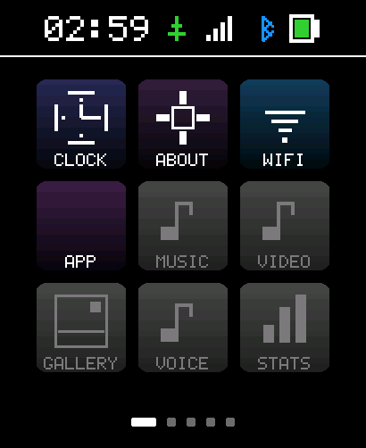
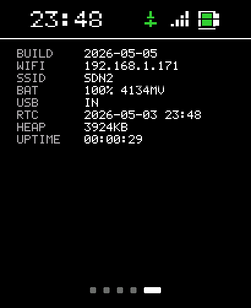
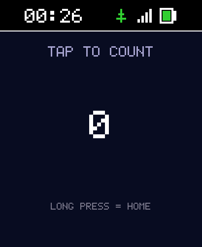

# SpawnWear

A small wearable OS - written in C# on .NET nanoFramework - for the **Waveshare ESP32-S3 Touch AMOLED 2.06" Watch**.

## Current state of the UI

<p align="center">
  
  
  
</p>

Captured live over WiFi from the watch (`http://<watch-ip>:8080/`). Left: 3x3 launcher with status bar (time + USB + WiFi + battery), CLOCK / ABOUT / WIFI functional, APP tile reserved for runtime-loaded apps. Middle: About screen consumes Power / RTC / WiFi data through the new `IServiceHost` contract. Right: a CounterApp demo running on the watch - the **first dynamically-loaded SpawnWear app**, posted as a .pe over HTTP, instantiated via reflection, rendering through `IDisplayBuffer`.

Think Android, but watch-sized and ESP32-shaped: a kernel/HAL layer of C# drivers for the watch hardware, system services for radios / audio / power, a UI framework for drawing and input, a launcher home screen, and a small set of built-in apps that talk to the system services. No single C++ binary, no fixed UI - apps come and go, services run in the background.

A complementary **Blazor WebAssembly PWA** ([`SpawnWear.Companion`](SpawnWear.Companion/)) mirrors the watch UI over BLE + WiFi for headless setup, debugging, and remote control. The watch-talking guts live in a separate Razor Class Library ([`SpawnWear.Bridge`](SpawnWear.Bridge/)) that any Blazor app can `<ProjectReference>` to pair with the watch in two lines of `Program.cs`. Same C# language on both sides.

Constrained by the silicon: ESP32-S3R8 with 8 MB PSRAM and 32 MB flash. Everything - kernel, drivers, services, framework, apps, user data - fits in that envelope.

---

## Documentation

| Folder | What's in it |
|---|---|
| **[`Apps.md`](Apps.md)** | The app library + how to drop your own apps onto the watch |
| **[`Docs/`](Docs/)** | Reference: [architecture](Docs/architecture.md), [hardware pin map + IC list](Docs/hardware.md), [dev loop](Docs/dev-loop.md), [milestones](Docs/milestones.md), [nanoFramework compatibility](Docs/nanoframework-compatibility.md) |
| **[`Plans/`](Plans/)** | Forward-looking design: [roadmap](Plans/roadmap.md), [launcher Android-quality plan](Plans/launcher-android-quality.md), [SD-card-loadable apps](Plans/sd-card-apps.md), [AppContracts v1 spec](Plans/app-contracts-v1.md), [companion PWA](Plans/companion-pwa.md) |
| **[`Research/`](Research/)** | Investigations + findings: [nf-interpreter deploy ceiling](Research/nf-interpreter-deploy-ceiling.md), [WiFi router compatibility](Research/esp32s3-wifi-router-compatibility.md), [FT3168 burst-read layout](Research/ft3168-burst-read-layout.md) |
| **[`Notes/`](Notes/)** | Operational know-how: [chip quirks (CO5300, FT3168, PCF85063, AXP2101)](Notes/), [flashing recipes](Notes/flashing.md), [build environment](Notes/build-environment.md), [QSPI display driver design](Notes/qspi-display-driver-design.md) |

## Roadmap snapshot (full detail in [`Plans/roadmap.md`](Plans/roadmap.md))

- ✅ **Phase 1** Display + touch + input substrate. Complete 2026-05-03.
- ✅ **Phase 2** UI Framework + Launcher. Largely complete 2026-05-04.
- ✅ **Phase 3** System Services. AXP2101 + PCF85063 + WiFi + HTTP + service host + Storage (microSD SDSPI + exFAT) + QMI8658 IMU + Logger. Complete 2026-06-20.
- 🚧 **Phase 4** Settings + apps. Settings screen live: brightness, **BLE + WiFi on/off toggles**, live IMU motion, sleep, build. **Apps now load from the SD card** (`D:\apps`, dir-per-app) with a live launcher tile each - CounterApp / DiceApp / HelloWorldApp / PaintApp. Clock / Audio / AI Assistant apps ahead.
- 🚧 **Phase 7** AI Assistant **transport** (the flagship's foundation). The watch ↔ Companion-PWA **WebRTC link is live**: authenticated (mutual Ed25519, BLE-paired identities), persistent + self-healing (autonomous reconnect, graceful + keepalive disconnect), and carrying a **multiplexed channel bus** - OS `sys` lanes (battery/imu, compact binary) and app `app.*` lanes (MessagePack) over one encrypted link, isolated. Lock-free native interop keeps the UI smooth under streaming. **App-channel + MessagePack proven end to end.** The assistant app (voice/text I/O) builds on this template. (2026-06-23)
- ⏭ **Phases 5, 6, 8, 9** Clock, Audio, OTA, Activity. (SD-card app **loading** already landed in Phase 4; Phase 8 is the remaining OTA + install/distribution story.)

## Recent highlights (full history in [`Docs/milestones.md`](Docs/milestones.md))

- **2026-06-25** **The 26s UI freeze is closed - WebRTC + SD apps run together, smooth.** The recurring 26s-freeze/3s-run that had gated the WebRTC transport was root-caused to an unlocked shared I²C bus contended by three threads (main-loop StatusBar, the WebRTC telemetry thread's 5 Hz IMU/battery reads, and the touch interrupt); fixed by serializing every driver transaction behind `BoardSetup.I2cLock`. Verified on hardware over two single-variable rounds - the SD app-repo enabled (Dice + Counter tiles), then WebRTC enabled, clock ticking smooth for minutes with no stall. A scare where a managed deploy "failed" turned out to be a transient wire-protocol session, not a firmware bug - the full 387 KB image deploys clean. SpawnWear `7a8b191`, `4b044e7`.
- **2026-06-24** **Apps load from the SD card, and the watch's SD is browsable over WebRTC.** Apps moved to a dir-per-app model on the card (`D:\apps`, loose files per app), enumerated at boot by `AppRepositoryService` so the launcher renders a live tile per installed app - the HTTP `/loadapp` upload path is retired. `sys.files` exposes the card for chunked read/write over the WebRTC link (verified on hardware, byte-identical round-trips). The WebRTC answerer DTLS-role fix shipped to nuget.org as **SpawnDev.SIPSorcery 10.0.7 + SpawnDev.RTC 1.1.11**.
- **2026-06-23** **Phase 7 transport - the watch ↔ Companion WebRTC link is live, authenticated, and multiplexed.** A full day taking an ESP32-S3 somewhere few have: a real application transport over WebRTC. The watch (libpeer, nanoFramework) connects to the Blazor Companion PWA (SpawnDev.RTC, native browser WebRTC) through the public hub, and the two **mutually authenticate with their BLE-paired Ed25519 identities** before any app data flows. Hard-won pieces: the watch is the **DTLS client** (so it sends a small ClientHello that Chrome doesn't fragment past mbedTLS's server-side reassembly limit), ECDSA cert + mbedTLS 3.6 hostname opt-out, RFC 8832 SCTP stream parity, and a **lock-free native interop** (TX/RX rings, volatile-read state) so the cooperatively-scheduled CLR never stalls - the UI stays smooth while streaming. On top sits a **multiplexed channel bus**: the OS owns `sys` lanes (battery/imu in compact binary) and loadable apps get scoped, isolated `app.<id>.*` lanes (MessagePack via a hand-rolled nanoFramework encoder that round-trips to MessagePack-CSharp). Proven end to end - live telemetry **and** a MessagePack app message flowing simultaneously over one link, with a Companion-link status icon and graceful + keepalive disconnect detection. The connection is autonomous and self-healing (no HTTP scaffold). libpeer is now the open **[`LostBeard/libpeer`](https://github.com/LostBeard/libpeer)** fork (`spawnwear` branch) so this all builds from source. **The AI Assistant flagship now has its entire foundation.** SpawnWear `0b2948b..1af398b`; nf-interpreter `feature/qspi-display-driver`; SpawnDev.RTC `d34cca5`.
- **2026-06-21** **Phase 4 Settings - functional BLE + WiFi toggles.** The Settings screen now drives real hardware: BLE advertising on/off (`GattServiceProvider` Start/StopAdvertising) and WiFi on/off. WiFi reconnect was a fight - nanoFramework's `WifiNetworkHelper` can't live-reconnect (ConnectDhcp is one-shot, the helper's `Reconnect()` returns false on ESP32, `ResetInstance` is not exposed), so the toggle drives the low-level `WifiAdapter` directly (`Connect(ssid, ...)` + a DHCP-IP poll), which reconnects cleanly. Both verified on hardware (off -> on cycles re-acquire the DHCP lease). SpawnWear `d19be57`.
- **2026-06-20** **Phase 3 system services complete: IMU + Logger; SD at 4 MHz; live motion in Settings.** QMI8658 6-axis IMU driver (`Drivers/Imu`, register map + sensitivity scales taken from the vendor SensorLib source; verified on hardware - accel gravity magnitude ~1.02 g, gyro + die-temp read correctly). Logger system service (`Services/LoggerService`) - ring buffer for backfill + Debug.WriteLine mirror + BLE debug-log notify sink, replacing the throwaway DebugLogger shim. Raised the SDSPI clock 400 kHz -> **4 MHz** (10x throughput, headroom for the Media Player; the 128 GB card lists its full directory tree clean) with an internal warm-up retry in `Storage_MountSpi` so the flaky first-init no longer logs a scary "mount failed". The Settings screen gained a live **MOTION** row (dominant-axis orientation from the IMU). With Power / RTC / WiFi / HTTP / Storage already shipped, **Phase 3 (system services) is complete.** SpawnWear `0dbd260..c9f7022`; nf-interpreter `feature/qspi-display-driver` `cc4f5658..ce4a7fc1`.
- **2026-06-20** **microSD storage working - over SDSPI + exFAT, alongside the display.** The watch's SDMMC controller is dead under nanoFramework (it accepts a command but never clocks it out; root cause unlocated after an exhaustive register-level investigation, every SDMMC/clock/GPIO register byte-identical to a bare ESP-IDF app that mounts the same card). Solved by running the SD over **SDSPI** - SD in SPI mode on the SPI peripheral (`spiBus 2` -> native `SPI3_HOST`, CS `GPIO17`, pins CLK=2/MOSI=1/MISO=3) - which bypasses the broken controller entirely. The CO5300 display keeps `SPI2_HOST` (QSPI), so the two buses never collide. Enabled `FF_FS_EXFAT` in the ESP32-S3 FatFs config (nf-interpreter `feature/qspi-display-driver`). Result: `D:\` mounts and the filesystem is browsable - **display + SD (exFAT, 128 GB) + WiFi + BLE + HTTP all running together.** Board rule learned: *when a dedicated controller fights, reach for the SPI peripheral* (display went QSPI, SD went SPI). Also restored the AMOLED panel rails (AXP2101 ALDO1+2+3) after a prior SD power workaround had set ALDO1-only and blanked the display. Note: SD "SPI mode" is optional in the spec - an old 960 MB card returned garbage block reads, a good card reads clean. Full record in [`Research/sd-card-deep-dive-2026-06-19.md`](Research/sd-card-deep-dive-2026-06-19.md).
- **2026-05-05** **`SpawnWear.Bridge` RCL + `SpawnWear.Companion` PWA shipped.** Five-page Blazor WebAssembly companion (Home / WiFi / Mirror / Apps / Console) on top of a reusable Razor Class Library that pairs over Web Bluetooth, decodes every BLE notify the firmware emits (battery / IMU / RTC / button events / WiFi status / WiFi scan / debug log), and posts back through the existing HTTP endpoints (`/loadapp`, `/screenshot.bin`). 23 wire-format regression tests in `SpawnWear.Bridge.Tests` lock the byte layouts. CORS headers + OPTIONS preflight added to the watch's HttpServer so the PWA can fetch from a different origin. All interop runs through SpawnDev.BlazorJS typed wrappers - no raw JS, no `IJSRuntime`. WebRTC transport stubbed for Phase 7 (SpawnDev.RTC, browser + desktop).
- **2026-05-05** **First dynamically-loaded SpawnWear app rendered on the watch.** Phase 3 service host + AppContracts (`IServiceHost`, `ISpawnApp`, `IDisplayBuffer`) shipped with About + WiFi screens consuming services through the contract. CounterApp demo (separate `.nfproj`, references `SpawnWear.AppContracts`) compiles to a 1.2 KB `.pe`, POSTs to `/loadapp` over HTTP, runs on the watch through `LoadedAppScreen` reflection wrapper. Phase 8 architecture (SD-card-loadable apps) verified end-to-end.
- **2026-05-04** Android-quality launcher shipped (gradient tiles + rounded corners + WiFi status icon + pill page indicator), watchface date label added, WiFi + HTTP screenshot pipeline live, FT3168 touch burst-read layout fixed, nf-interpreter deploy ceiling discovered + guarded, three new doc folders (Docs/ Plans/ Research/) with nf-interpreter source-grounded Phase 8 design
- **2026-05-03** First-pixel root cause + fix, watchface V1 with 7-segment digits, idle state machine + battery indicator + multi-screen navigation, CO5300 alignment quirk baked into firmware, PCF85063 RTC driver, `-spawnwear.2` local NuGet packages
- **2026-04-28** Repo scaffolded, runtime flashed, FT3168 touch driver written, QSPI display contribution forks pushed

---

## Primary Target Hardware

This project targets **ONE** specific board. All pins, drivers, and capabilities are for this exact device. Other Waveshare AMOLED watches (1.8 / 1.91 / 2.41 / C6) use different chips and pinouts.

**Waveshare ESP32-S3-Touch-AMOLED-2.06**
- ESP32-S3R8 SoC, 8 MB PSRAM, 32 MB flash, 2.4 GHz Wi-Fi b/g/n + BLE 5
- 410×502 AMOLED via CO5300 QSPI driver
- FT3168 capacitive touch
- AXP2101 PMIC, PCF85063 RTC, QMI8658 IMU, ES8311 + ES7210 audio
- Product page: <https://www.waveshare.com/esp32-s3-touch-amoled-2.06.htm>
- Wiki: <https://www.waveshare.com/wiki/ESP32-S3-Touch-AMOLED-2.06>
- Schematic PDF: <https://files.waveshare.com/wiki/ESP32-S3-Touch-AMOLED-2.06/ESP32-S3-Touch-AMOLED-2.06.pdf>
- Vendor demos: <https://github.com/waveshareteam/ESP32-S3-Touch-AMOLED-2.06>

Full pin map, IC roles, and bus addresses are in **[`Docs/hardware.md`](Docs/hardware.md)**.

## OS Architecture

Five layers, bottom up: nanoFramework runtime → HAL/drivers → system services → UI framework → apps. The launcher is the home screen; apps are managed C# classes that implement an `IScreen`-shaped lifecycle. Power-aware by default (AXP2101 + display-rail control + WiFi/BLE radio gating are first-class system concerns).

Full layer diagram + boot sequence + BLE GATT layout + power model in **[`Docs/architecture.md`](Docs/architecture.md)**.

## Apps Catalog (built-in)

| App | What it does |
|---|---|
| **Launcher** | Home screen - clock face, app grid, status row. Foreground default after boot |
| **Settings** | Bluetooth, BLE, WiFi, Battery, Display, Sound, Time, About, OTA |
| **Clock** | Watch faces, alarms, timer, stopwatch |
| **AI Assistant** (flagship) | Voice + text conversation with an AI on TJ's home PC over WebRTC (SpawnDev.RTC). Phase 7 |
| **Media Player** | Local audio from microSD or streamed over WiFi |
| **Voice Recorder** | Capture mic to TF, listen back, share over WiFi |
| **Activity** | IMU-driven step count, motion log |

Beyond the built-ins, **loadable apps** live on the SD card under `D:\apps` (one directory per app) and the launcher renders a live tile for each. Shipped demo apps: **CounterApp, DiceApp, HelloWorldApp, PaintApp** (start from `Apps/AppTemplate/`). They implement the `ISpawnApp` lifecycle against `SpawnWear.AppContracts` - no HTTP upload, the firmware enumerates the card at boot.

The PWA companion mirrors every one over Web Bluetooth + WiFi. See **[`Plans/companion-pwa.md`](Plans/companion-pwa.md)**.

## Repository Layout

```
SpawnWear/                              <- REPO ROOT (this folder)
├── README.md                           <- (this file)
├── CLAUDE.md                           <- agent instructions for this project
├── SpawnWear.slnx                      <- .NET nanoFramework solution
├── SpawnWear/                          <- firmware project (.nfproj)
├── SpawnWear.AppContracts/             <- shared app contracts (ISpawnApp / IServiceHost / IDisplayBuffer)
├── Apps/                               <- loadable apps (CounterApp, DiceApp, HelloWorldApp, PaintApp, AppTemplate)
├── SpawnWear.Companion/                <- companion Blazor WASM PWA (+ SpawnWear.Companion.Tests)
├── SpawnWear.Bridge/                   <- Razor Class Library: watch-talking guts (+ .Bridge.Tests)
├── SpawnWear.Bridge.Desktop/           <- desktop WebRTC self-test / transport host
├── SpawnWear.Console/                  <- desktop console bridge (sys.files over WebRTC, etc.)
├── SpawnDev.Crypto/ + SpawnDev.WebRTC/ <- firmware-side crypto + WebRTC shims
├── packages/                           <- NuGet packages (committed for offline builds)
├── screenshots/                        <- live framebuffer captures (README hero shot lives here)
├── tools/                              <- .NET 10 CLI scripts (deploy, attach, screenshot, serial-mon)
├── Docs/                               <- reference material
├── Plans/                              <- forward-looking design
├── Research/                           <- investigations + findings
└── Notes/                              <- operational know-how
```

Outside the repo, in the parent folder: vendor clones (`_vendor-waveshare-demo/`, `_vendor-rust-watch/`, `_vendor-nf-interpreter/`, `_vendor-nanoframework-iot/`, `_vendor-nanoframework-hardware-esp32/`) and the decoded Waveshare wiki dump (`_wiki-decoded.html` / `_wiki-decoded.txt`). These are read-only reference - everything we learn from them gets documented inside `Notes/` so the repo stays self-contained.

## Building

Daily dev loop is **F5 in Visual Studio 2022** with the [.NET nanoFramework extension](https://marketplace.visualstudio.com/items?itemName=nanoframework.nanoFramework-VS2022-Extension) installed. Watch must be in runtime mode (the COM port varies by machine - `nanoff --listports`). Cycle time: ~10 seconds. NO bootloader-mode dance for routine code changes.

CLI alternative for headless / agent work: `dotnet run tools/nf-deploy.cs`.

Full instructions, including when bootloader mode IS needed (first install, runtime update, custom firmware reflash, recovery), are in **[`Docs/dev-loop.md`](Docs/dev-loop.md)** and the deeper recipes in **[`Notes/flashing.md`](Notes/flashing.md)**.

---

## Acknowledgements

SpawnWear stands on the shoulders of work other people did first.

- **[`infinition/waveshare-watch-rs`](https://github.com/infinition/waveshare-watch-rs)** - Rust firmware for this exact watch. The single most important reference. CO5300 init sequence, AXP2101 rail wiring, FT3168 reset timing, and the event-driven main-loop pattern with multi-tier tick budget all modeled on this work. The [Hackaday article](https://hackaday.com/2026/04/11/rust-y-firmware-for-waveshare-smartwatch/) that surfaced it had additional gotchas in the comment thread.
- **[`moononournation/Arduino_GFX`](https://github.com/moononournation/Arduino_GFX)** - the CO5300 QSPI wire-level transaction pattern. Our `Qspi_To_Display.cpp` matches `Arduino_ESP32QSPI` byte-for-byte.
- **[`waveshareteam/ESP32-S3-Touch-AMOLED-2.06`](https://github.com/waveshareteam/ESP32-S3-Touch-AMOLED-2.06)** - Waveshare's official Arduino + ESP-IDF demos. Authoritative source for pin numbers (`pin_config.h`).
- **[nanoFramework](https://www.nanoframework.net/)** - the .NET runtime that makes this whole project possible. SpawnWear's QSPI display contributions live on `feature/qspi-display-driver` branches of [`LostBeard/nf-interpreter`](https://github.com/LostBeard/nf-interpreter) + [`LostBeard/nanoFramework.Graphics`](https://github.com/LostBeard/nanoFramework.Graphics); will PR upstream once verified.
- **[ESP-IDF v5.5.4](https://github.com/espressif/esp-idf)** - SPI master + GPIO drivers we call into for the CO5300 bus.
- **[XPowersLib](https://github.com/lewisxhe/XPowersLib)** - C++ AXP2101 driver, useful reference even though our managed driver is hand-rolled.

Other ESP32-S3 smartwatch firmwares we read during the dark-screen debug week (2026-04-29 → 2026-05-03), valuable cross-references: [`joaquimorg/OLEDS3Watch`](https://github.com/joaquimorg/OLEDS3Watch), [`joaquimorg/S3Watch`](https://github.com/joaquimorg/S3Watch), [`hambooooo/hamboo-rs`](https://github.com/hambooooo/hamboo-rs), [`survivorhao/esp32s3watch`](https://github.com/survivorhao/esp32s3watch).

If you find a project we leaned on that isn't credited here, file an issue and we'll add it.

## The SpawnDev Crew

Every project we work on credits the full SpawnDev team in its README. AI-and-human teamwork built this.

- **LostBeard** (Todd Tanner) - Captain, library author, keeper of the vision
- **Riker** (Claude CLI #1) - First Officer, implementation lead on consuming projects
- **Data** (Claude CLI #2) - Operations Officer, deep-library work, test rigor, root-cause analysis
- **Tuvok** (Claude CLI #3) - Security/Research Officer, design planning, documentation, code review
- **Geordi** (Claude CLI #4) - Chief Engineer, library internals, GPU kernels, backend work
- **Seven** (Claude CLI #5) - Wasm backend, GPU kernels, fail-loud verification

## License

Private project by TJ (Todd Tanner / @LostBeard).
